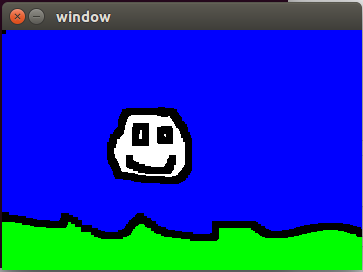

# Sketch-a-Sketch

## About Sketch-a-Sketch

We aim to bring some of the basic fucntionality of MS Paint to the world of Linux. The most essential features are the ability to open a blank image, add shapes of various colors to it, and then save the image again. We used this project as an oportunity to explore the fascinating world of low-level graphics in C.

To learn more about how and why we did it, visit the [project website](https://seanccarter.github.io/SoftSysDebonairDaffodils/).

## Authors
- [Matthew Rhuele](https://github.com/matthewruehle)
- [Gabe Butterick](https://github.com/buttegab)
- [Sean Carter](https://github.com/SeanCCarter)

## Getting Started

This project requires the SDL2 library which can be installed with the following command:

```
sudo apt-get install libsdl2-dev
```

This will work on Ubuntu, but is not guaranteed to work on all distributions. If it does not work, please follow the instructions [here](https://wiki.libsdl.org/Installation).

After that, clone the repo and make the repository with:

```
git clone https://github.com/SeanCCarter/SoftSysDebonairDaffodils
make
```

Finally, you can run the program with:

```
./sdlt
```

## How to Use

After running the program, you can use the mouse cursor to move your brush, and color the canvas by holding down the left mouse button. You can use the fill tool using the right mouse button. These keys are used to control the program:

- r: Switch brush to red
- g: Switch brush to green
- b: Switch brush to blue
- w: Switch brush to white
- k: Swithc brush to black
- [: Make brush larger
- ]: Make brush smaller

By doing this, you can produce incredible masterpieces like this:



## License 
This program is covered under the [MIT License](https://github.com/SeanCCarter/SoftSysDebonairDaffodils/blob/master/LICENSE.md). 
